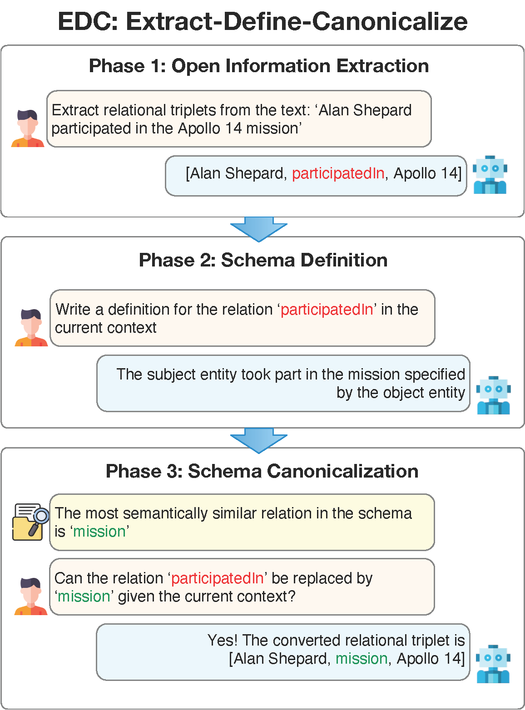

# EDC: Extract, Define, Canonicalize

LLMベースの知識グラフ構築フレームワーク

論文: [Extract, Define, Canonicalize: An LLM-based Framework for Knowledge Graph Construction](https://arxiv.org/abs/2404.03868) (Zhang & Soh, 2024)

```
@article{zhang2024extract,
  title={Extract, Define, Canonicalize: An LLM-based Framework for Knowledge Graph Construction},
  author={Zhang, Bowen and Soh, Harold},
  journal={arXiv preprint arXiv:2404.03868},
  year={2024}
}
```

## EDCの仕組み

EDCは3つのフェーズで非構造化テキストから知識グラフ（トリプル: 主語-関係-目的語）を構築します。

1. **Extract（抽出）** - テキストからオープンな知識トリプルを抽出（Open Information Extraction）
2. **Define（定義）** - 抽出された関係の意味をLLMで定義
3. **Canonicalize（正規化）** - 抽出された関係をターゲットスキーマの関係にマッピング

<p align="center">
  
</p>

## セットアップ

### 依存関係のインストール

```bash
conda env create -f environment.yml
conda activate edc
```

または pip:

```bash
pip install -r requirements.txt
```

### 環境変数の設定（.envファイル）

プロジェクトルートに `.env` ファイルを作成し、使用するサービスの認証情報を設定します。

```env
# Azure OpenAI（LLM/Embedder用）
AZURE_OPENAI_ENDPOINT=https://your-resource.openai.azure.com/
AZURE_OPENAI_API_KEY=your-api-key
AZURE_OPENAI_API_VERSION=2024-12-01-preview
AZURE_OPENAI_CHAT_DEPLOYMENT_NAME=gpt-4
AZURE_OPENAI_EMBEDDING_DEPLOYMENT_NAME=text-embedding-3-small

# Azure Document Intelligence（PDF処理用・オプション）
AZURE_DI_ENDPOINT=https://your-resource.cognitiveservices.azure.com/
AZURE_DI_API_KEY=your-api-key
AZURE_DI_MODEL=prebuilt-layout

# OpenAI（Azure以外を使う場合）
OPENAI_KEY=your-openai-api-key
```

## CLI使用方法（run.py）

### 基本的な使い方

```bash
# Azure OpenAI でフォルダ内のファイルを一括処理（スキーマ自動発見）
python run.py --provider azure --input_dir ./docs --enrich_schema --output_dir ./output/result

# 汎用スキーマを初期値にして処理（推奨）
python run.py --provider azure --input_dir ./docs --target_schema_path ./schemas/generic_schema.csv --enrich_schema --output_dir ./output/result

# ドメイン固有スキーマを指定して処理
python run.py --provider azure --input_dir ./docs --target_schema_path ./schemas/my_schema.csv --output_dir ./output/result
```

### 主要な引数

| 引数 | デフォルト | 説明 |
|------|-----------|------|
| `--provider` | なし | LLMプロバイダー。`azure`/`openai`/`local` |
| `--input_dir` | `./datasets` | 入力フォルダ（.txt / .pdf / .md を自動検出） |
| `--target_schema_path` | なし | ターゲットスキーマCSV。未指定でスキーマフリーモード |
| `--enrich_schema` | False | マッチしない関係を新スキーマとして自動追加 |
| `--chunk_method` | `line` | テキスト分割方式。`line` / `heading` / `recursive` |
| `--chunk_size` | 1000 | 最大チャンクサイズ（文字数。`recursive` 時のみ有効） |
| `--refinement_iterations` | 0 | 反復改善の回数（0=なし） |
| `--output_dir` | `./output/tmp` | 出力先ディレクトリ（既存不可） |
| `--logging_verbose` | - | 詳細ログ出力 |

### テキスト分割方式（--chunk_method）

| 方式 | 説明 | 用途 |
|------|------|------|
| `line` | 改行ごとに1チャンク（デフォルト） | 1行1文のテキストファイル |
| `heading` | Markdownの見出し（`#`）単位で分割 | Markdown / Azure DI出力 |
| `recursive` | 段落→文→文字数で再帰的に分割 | 長文テキスト |

### 入力ファイル形式

- **テキストファイル (.txt)**: `--chunk_method` に従い分割
- **Markdownファイル (.md)**: `--chunk_method heading` 推奨
- **PDFファイル (.pdf)**: Azure Document Intelligenceでページごとに抽出（.env設定必要）

### スキーマの運用モード

| モード | 引数 | 動作 |
|--------|------|------|
| スキーマフリー | `--enrich_schema` | 全リレーションを新規スキーマとして発見 |
| 汎用スキーマ | `--target_schema_path ./schemas/generic_schema.csv --enrich_schema` | 12種の汎用関係にマッチング → 不一致は新規追加 |
| 固定スキーマ | `--target_schema_path ./schemas/my_schema.csv` | 指定スキーマにのみマッチング（不一致は破棄） |
| 固定+拡張 | `--target_schema_path ./schemas/my_schema.csv --enrich_schema` | 指定スキーマにマッチング → 不一致は新規追加 |

### スキーマファイル形式（CSV）

ヘッダーなし、`relation,definition` の2カラム:

```csv
IS_A,"The subject is a type or subclass of the object (classification or inheritance)."
PART_OF,"The subject is a part or component of the object."
HAS_ATTRIBUTE,"The subject has the attribute or property specified by the object."
```

同梱スキーマ:
- `schemas/generic_schema.csv` - 汎用12関係タイプ（IS_A, PART_OF, HAS_ATTRIBUTE, AFFECTS, CAUSES 等）
- `schemas/example_schema.csv` - 汎用的な関係定義の例

### 使用例

```bash
# スキーマフリー・自動発見モード
python run.py --provider azure --input_dir ./docs --enrich_schema --output_dir ./output/test1

# 汎用スキーマ + Markdown見出し分割（推奨）
python run.py --provider azure --input_dir ./docs --target_schema_path ./schemas/generic_schema.csv --enrich_schema --chunk_method heading --output_dir ./output/test2

# 再帰分割（チャンクサイズ500文字）
python run.py --provider azure --input_dir ./docs --enrich_schema --chunk_method recursive --chunk_size 500 --output_dir ./output/test3

# 反復改善あり（2回）
python run.py --provider azure --input_dir ./docs --enrich_schema --refinement_iterations 2 --output_dir ./output/test4

# ローカルモデル使用
python run.py --input_dir ./datasets --enrich_schema --output_dir ./output/test5
```

## Web UI使用方法（app.py）

Streamlitベースのインタラクティブなインターフェースも利用できます。

```bash
streamlit run app.py
```

機能:
- ファイルアップロード（テキスト/PDF、複数可）
- Azure OpenAI / OpenAI の切り替え
- スキーマの使用/未使用の選択
- 結果のインタラクティブ表示
- JSON / CSV のダウンロード

## 出力ファイル

処理完了後、`output_dir` に以下のファイルが生成されます。

```
output_dir/
  iter0/
    result_at_each_stage.json   # 各ステージの中間結果（OIE, 定義, 正規化）
    canon_kg.txt                # 正規化済みトリプル（1行1テキスト分）
  triplets.json                 # ファイル別にグループ化されたトリプル
  discovered_schema.csv         # 発見されたスキーマ一覧
```

### triplets.json

```json
[
  {
    "file": "document.md",
    "texts": [
      {
        "input_text": "入力テキスト...",
        "triplets": [["主語", "関係", "目的語"], ...]
      }
    ]
  }
]
```

### discovered_schema.csv

```csv
"relation","definition","count"
"located in","The subject entity is located in the place specified by the object entity.","15"
"developed by","The subject was developed by the entity specified by the object.","8"
```

## 反復改善（Schema Retriever）

Schema Retrieverを使用して、表面的に見つけにくい関係を反復的に抽出できます。

学習データの準備:

```bash
python collect_schema_retrieval_data.py \
    --tekgen_path /path/to/tekgen \
    --relation_definition_csv_path /output/path/to/tekgen/relation/definitions \
    --dataset_size N \
    --output_path /output/dataset/path
```

TEKGENデータセットは[こちら](https://storage.googleapis.com/gresearch/kelm-corpus/updated-2021/quadruples-test.tsv)からダウンロードできます。ファインチューニングについては[このリポジトリ](https://github.com/kamalkraj/e5-mistral-7b-instruct)を参照してください。

使用時は以下の引数を追加:

```bash
python run.py --provider azure --input_dir ./docs --enrich_schema \
    --sr_adapter_path /path/to/trained/adapter \
    --refinement_iterations 2 \
    --output_dir ./output/refined
```

## 評価

`evaluate` フォルダとそのREADMEを参照してください。

## 注意事項

- デフォルトのEmbedder（`intfloat/e5-mistral-7b-instruct`）は7Bパラメータで計算リソースを大量に消費します。`--provider azure` を使用するか、軽量モデル（`all-MiniLM-L6-v2` 等）の指定を推奨します
- 出力ディレクトリが既に存在する場合はエラーになります。削除してから再実行してください
- プロンプトテンプレートやFew-shotの例は `prompt_templates/` と `few_shot_examples/` で変更可能です
- 日本語テキストの場合、リレーション名は自動的に英語（snake_case）で出力されます。エンティティ名は日本語のまま保持されます
