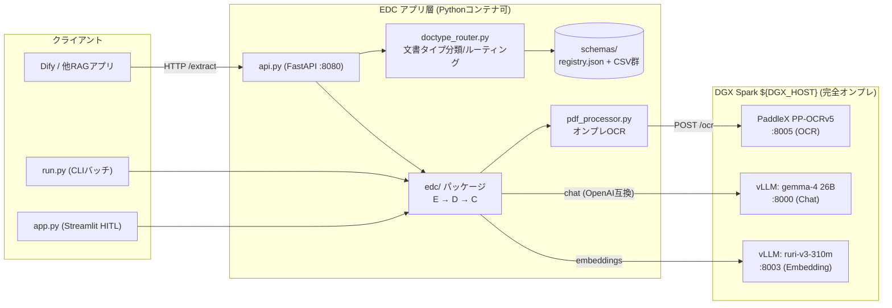
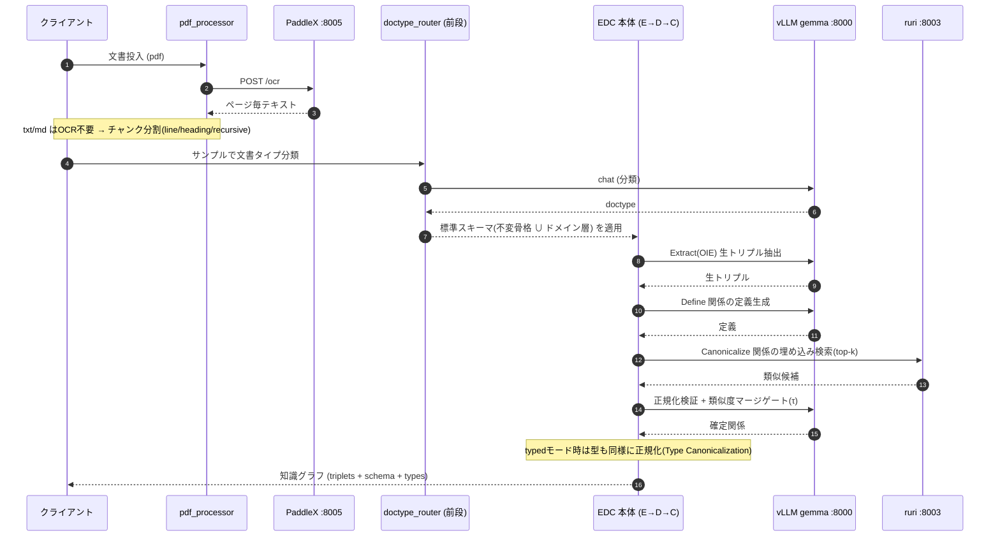
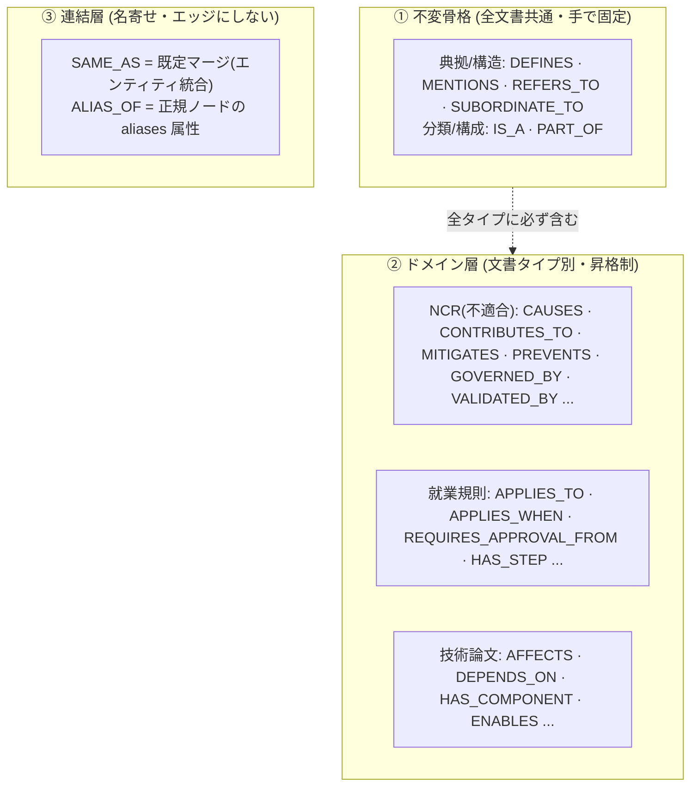
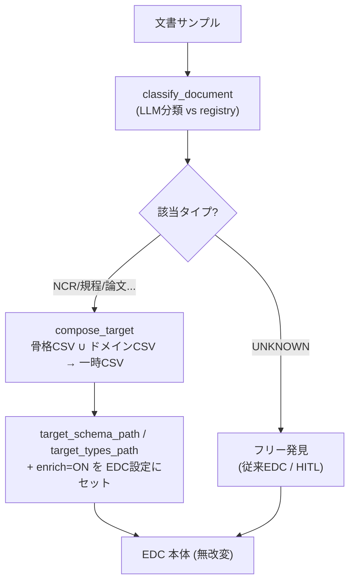
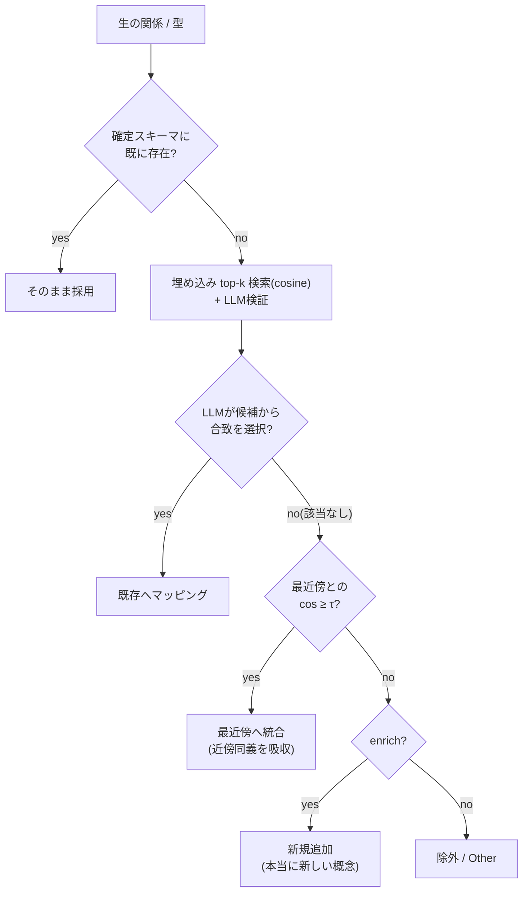
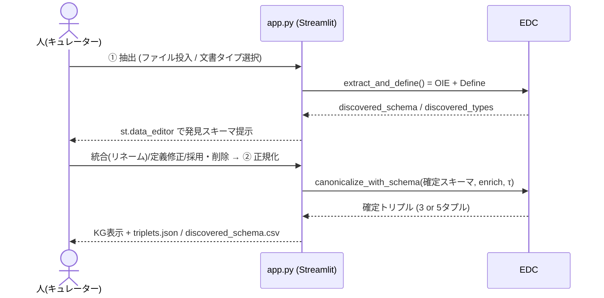
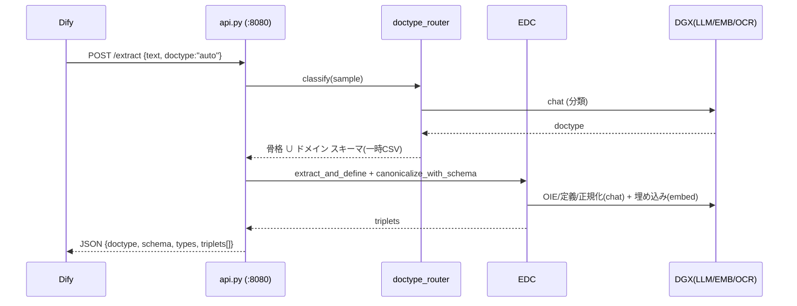
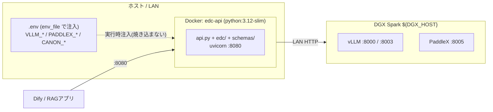
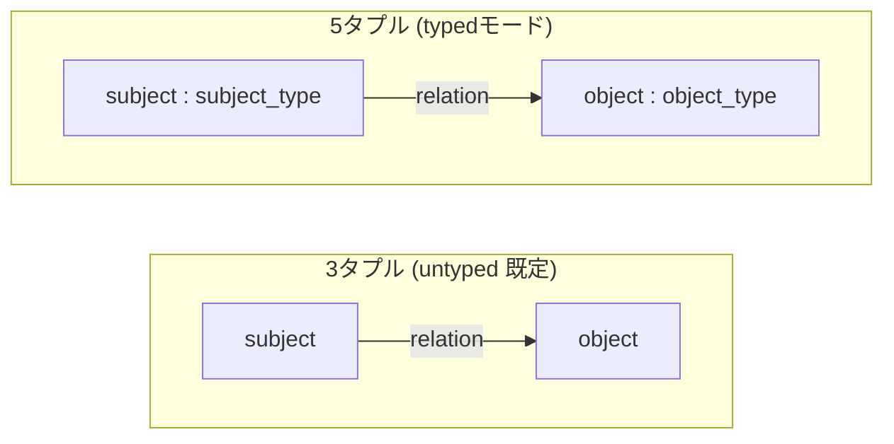

# EDC ナレッジグラフ構築システム 設計書

LLMベースの知識トリプル抽出フレームワーク **EDC (Extract → Define → Canonicalize)** を、
**完全オンプレ**・**文書タイプ別スキーマ**・**Human-in-the-loop**・**外部API/コンテナ**対応に
拡張したシステムの設計書。

---

## 1. 目的とスコープ

社内技術文書（不適合報告書・規程・規格・技術文書 等）から、後段のRAG/QA/分類で使える
**知識グラフ（トリプル）** を、外部サービスに一切送信せず（完全ローカル）構築する。

設計上の要点：

- **完全オンプレ**: LLM・埋め込み・OCR をすべて社内 DGX Spark 上で稼働（外部送信なし）。
- **妥当かつ最小限のエッジ**: 文書タイプ別の標準スキーマ＋半自動拡張＋類似度マージで、
  スキーマの際限ない肥大化を防ぐ。
- **半自動化(HITL)**: 精度改善のため、スキーマを人がレビュー/キュレーションできる。
- **外部から呼べる**: 他RAGアプリ / Dify から HTTP(API) で呼べる。

---

## 2. 全体アーキテクチャ



- **アプリ層**（api.py / run.py / app.py / edc パッケージ）は、LLM・埋め込み・OCR を
  すべて HTTP でDGX Sparkに委譲する。よって**アプリ層は軽量**（torch/transformers不要）。
- 3つのアクセス面（CLI / Streamlit / HTTP API）が同じコア（`edc/`）を共有する。

---

## 3. 処理パイプライン

文書入力から知識グラフまでの流れ。**前段(タイプ分類)** と **EDC本体(E→D→C)** と
**連結層(名寄せ)** の3部構成。



各ステージの実装：

| ステージ | 実装 | 入力 → 出力 |
|---|---|---|
| OCR | `pdf_processor._extract_paddlex_remote` | PDF → ページ毎テキスト |
| Extract (OIE) | `edc/extract.py` Extractor | テキスト → 生トリプル(3 or 5タプル) |
| Define | `edc/schema_definition.py` SchemaDefiner | 生関係 → 定義 |
| Canonicalize | `edc/schema_canonicalization.py` SchemaCanonicalizer | 生関係 → 確定スキーマへ写像 |
| Type Canon. | `edc/type_canonicalization.py` TypeCanonicalizer | 生型 → 確定型へ写像 |

---

## 4. スキーマ設計（3層）

スキーマは「**不変骨格** ＋ **文書タイプ別ドメイン層** ＋ **連結層**」の3層。
これが「定型を固定し、それ以外を半自動で足す」設計の核。



- **① 不変骨格**: 文書タイプに依存しない骨格。ベンチマークの5クエリ型が完全性を要求する
  関係の閉集合。`schemas/kg_backbone_*.csv`。
- **② ドメイン層**: 文書タイプ固有。`schemas/domain_<type>_*.csv`。新しいクエリ型が必要な
  新文書タイプが来たときだけ昇格・追加（昇格制）。
- **③ 連結層**: 同一・別名は**エッジでなく名寄せ**で処理（1実体1ノード）。エッジ化すると
  二重計上になるため骨格から除外。`ALIAS_OF`→属性、`SAME_AS`→マージ（暫定リンクのみHITL用）。

レジストリ（`schemas/registry.json`）が「文書タイプ→説明＋ドメインCSV」を保持し、
ルーターが `不変骨格 ∪ ドメイン層` を合成して EDC に渡す。

---

## 5. 前段ルーター（文書タイプ分類）

LLMの役割は **「どのタイプか」の分類のみ**。スキーマ設計はさせない（事前固定）。



- `--doctype auto`（CLI）/「文書タイプ: 自動判定」（UI）/ `POST /extract {doctype:"auto"}`（API）。
- 未知タイプはフリー発見＋HITLにフォールバックし、キュレーション結果を新タイプとして
  レジストリに登録（自己ブートストラップ）。

---

## 6. 正規化と類似度マージゲート

スキーマの際限ない肥大化を防ぐ中核ロジック（関係・型で対称）。
`SchemaCanonicalizer.canonicalize` / `TypeCanonicalizer.canonicalize`。



- 閾値 `τ = CANON_MERGE_THRESHOLD`（既定 0.9）。`τ`未満（本当に新規）だけ追加し、
  近傍同義はマージ → 「初期を与えて漏れは追加、ただし際限なく増やさない」。
- 実測: ある不適合報告書でフリー発見 95関係 → ドメイン初期スキーマで 24関係に収束。

**設計上の注意（force-fit）**: ドメインに合わない汎用すぎる初期スキーマを当てると、
本来別概念がコア関係に押し込まれ精度が落ちる。→ 文書タイプ別のドメイン層で緩和。

---

## 7. Human-in-the-loop（スキーマ・キュレーション）

EDC本体を Phase A / Phase B に分割し、間に人手レビューを挟む（`app.py`）。



- Phase A: `EDC.extract_and_define()`（ファイル出力なし）。
- Phase B: `EDC.canonicalize_with_schema()`（人手で確定したスキーマで再正規化）。
- 関係スキーマと型スキーマを対称にキュレーション。型は「初期型＋漏れ追加(enrich)」。

---

## 8. アクセス面と API

3面が同じコアを共有。外部連携は FastAPI（OpenAPI自動公開）。



| エンドポイント | 用途 |
|---|---|
| `POST /extract` | テキスト → KG（doctypeで標準スキーマ自動適用）|
| `POST /extract_file` | .txt/.md/.pdf アップロード → KG |
| `POST /classify` | 文書タイプ分類のみ |
| `GET /doctypes` | 登録タイプ一覧 |
| `GET /health` | ヘルスチェック |

Dify連携: `http://<host>:8080/openapi.json` をカスタムツールとして取込 → `/extract` を呼ぶ。

---

## 9. デプロイ / コンテナ構成



- イメージは**スリム**（`requirements-api.txt`: openai/requests/numpy/tqdm/dotenv/fastapi/uvicorn のみ）。
- `.env` はイメージに焼き込まず実行時注入。LLM/埋め込み/OCR はDGX側のまま。
- 起動: `docker compose up -d --build` → `curl :8080/health`。

---

## 10. データモデル



APIレスポンス（`/extract`）:
```json
{
  "doctype": "NCR_不適合是正処置報告書",
  "classification": {"type": "...", "confidence": 1.0, "reason": "..."},
  "schema_": {"CAUSES": "原因が...", "...": "..."},
  "types":   {"Defect": "欠陥...", "...": "..."},
  "n_input_chunks": 82,
  "n_triplets": 153,
  "triplets": [
    {"subject": "予熱不足", "subject_type": "Cause", "relation": "CAUSES",
     "object": "低温割れ", "object_type": "Defect"}
  ]
}
```

---

## 11. コンポーネント一覧

| ファイル | 責務 |
|---|---|
| `api.py` | FastAPIサービス（自己完結のパイプライン＋エンドポイント）|
| `run.py` | CLIバッチ（収集→チャンク→`--doctype`/`--provider`→EDC→出力）|
| `app.py` | Streamlit HITL（2フェーズ・キュレーション、文書タイプ選択）|
| `doctype_router.py` | 文書タイプ分類・標準スキーマ合成（骨格∪ドメイン）|
| `pdf_processor.py` | オンプレPDF(PaddleX)／Azure DIロールバック |
| `edc/edc_framework.py` | EDCクラス: `oie / schema_definition / schema_canonicalization / type_canonicalization / extract_kg / extract_and_define / canonicalize_with_schema` |
| `edc/extract.py` | OIE(Extractor) |
| `edc/schema_definition.py` | 関係定義(SchemaDefiner) |
| `edc/schema_canonicalization.py` | 関係正規化＋類似度マージゲート(SchemaCanonicalizer) |
| `edc/type_canonicalization.py` | 型正規化＋マージゲート(TypeCanonicalizer) |
| `edc/utils/llm_utils.py` | プロバイダ(vllm/azure/openai)・埋め込み・有限リトライ＋タイムアウト |
| `schemas/registry.json` + CSV | 文書タイプ・レジストリと標準スキーマ群 |

---

## 12. 設定（.env 主要項目）

| 変数 | 役割 |
|---|---|
| `LLM_PROVIDER` | 既定プロバイダ（`vllm`）|
| `VLLM_ENDPOINT` / `VLLM_MODEL` | Chat LLM（gemma-4 @8000）|
| `VLLM_EMBEDDING_ENDPOINT` / `VLLM_EMBEDDING_MODEL` | 埋め込み（ruri @8003）|
| `VLLM_TIMEOUT` / `VLLM_MAX_RETRIES` | 1呼び出しのタイムアウト/最大リトライ（無限ハング防止）|
| `PDF_PROCESSOR` / `PDF_BACKEND` | `onprem` / `paddleocr_remote`（既定）|
| `PADDLEX_ENDPOINT` / `PADDLEX_TIMEOUT` | PaddleX OCR（@8005）|
| `CANON_MERGE_THRESHOLD` | 類似度マージ閾値 τ（既定 0.9）|
| `AZURE_*` | 緊急ロールバック用（既定コメントアウト）|

---

## 13. 既知の制約・今後

- **条件付きエッジ**: 「金額≥1000万→役員承認」のような閾値付き条件は、素の3/5タプルでは
  構造化しきれない。条件ノード化（`Rule -APPLIES_WHEN-> Condition{値,演算子}`）かエッジ属性が必要。
- **チャンク分割**: フォーム文書は「ラベル↵値」が分断され退化トリプル（自己ループ等）が出る。
  ラベル:値の束ね or 見出し/再帰分割で改善余地。
- **同名異義の曖昧性解消（WSD）**・**専門用語辞書アンカー**・**グラフDB格納/スケール**は本システムの
  範囲外（後段レイヤ）。
- **refinement（反復改善）** は CLI/EDC本体に存在するが、API(one-shot)では未使用。
